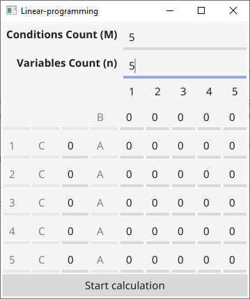
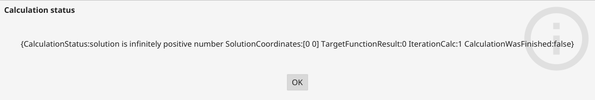

# go-linear-programming-task
Solving a linear programming task by the method of parameter evolution
## Examples
Main page  
  
"Calc finish" message  

## Is work in progress?
No. It was my study project, and I just want to forget it :). But I'm ready to check any pull requests, or answer some questions.
## Key features
- It's work
- Interface by fyne, so you could build it for any platform
- Simple statistic module, with output in csv format
## Linear statistic module usage
Just add it to main.go
```
    log.SetOutput(ioutil.Discard)
    linprogtask.CalcRandom(10, 100, 100, "filepath", true)
```
And comment
```
    program := _interface.InitInterface()
    program.ShowInterface()
```
So main.go file should looks something like that
```
    package main
    
    import (
        "io/ioutil"
        "log"
        "math/rand"
        "time"
    
        "github.com/GrigoryKrasnochub/go-linear-programming-task/linprogtask"
    )
    
    func main() {
        rand.Seed(time.Now().UTC().UnixNano())
    
        //program := _interface.InitInterface()
        //program.ShowInterface()
    
        //Disable logs
    
        log.SetOutput(ioutil.Discard)
        linprogtask.CalcRandom(10, 100, 100, "filepath", true)
    }
```
### Statistic module csv output
Output of statistic module return data in csv format. So you can use any program you like, to open and analyze it.
So you can save it to file, just use function CalcRandom, with filepath parameter.

# Ru docs
Решение задачи линейного программирования методом эволюции параметра, все подробности выше!
